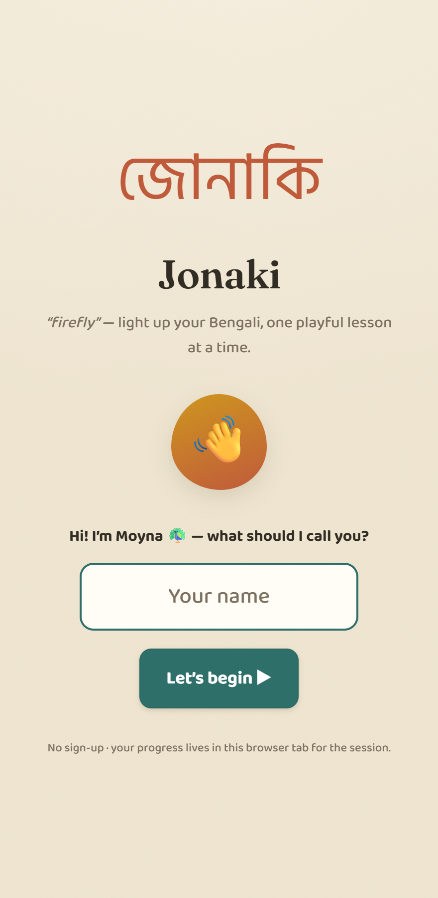
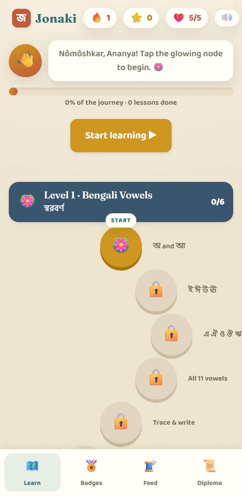
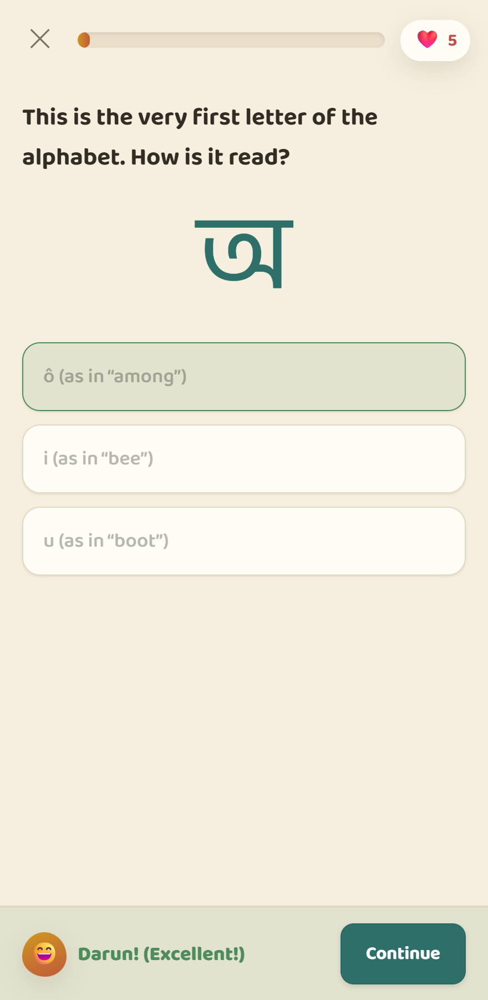
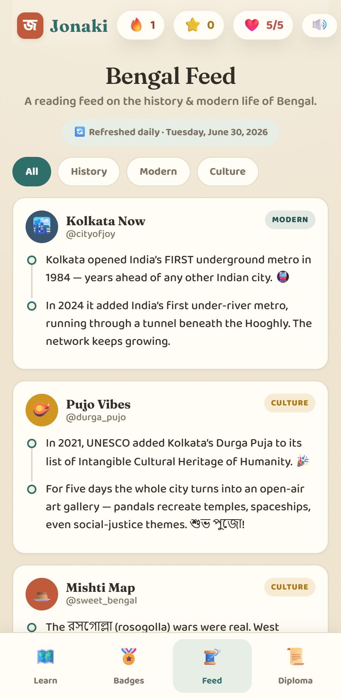
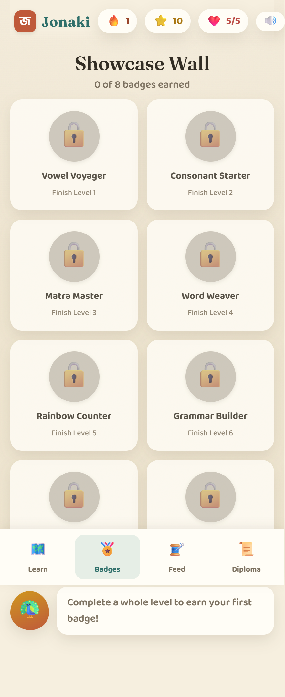

<div align="center">

# জোনাকি · Jonaki

**A gamified, Duolingo-style web app for learning the basics of Bengali — reading, writing & speaking.**

*“Jonaki” means **firefly** — a little light to guide you through the script.*

🔗 **Live demo:** https://ash-codess.github.io/Jonaki/

</div>

---

<div align="center">
  
  
  
</div>

## ✨ What it does

- **8 progressive levels, 62 lessons** — from the script (vowels, consonants, the *matra* vowel-sign system, conjuncts) through vocabulary, grammar, conversation, and reading & writing. Aimed at a solid **A2** foundation.
- **7 exercise types**, mixed throughout: multiple choice, match script-to-sound, type the Bengali word, audio recognition, tap-to-build sentences, **trace-the-letter** (canvas), and **speaking** practice.
- **Gamified**: XP, a day-streak flame, a hearts/lives system, a unique **badge per level**, a node-based **winding path map**, confetti and synthesized **sound effects** (correct / wrong / lesson-complete), plus a mute toggle.
- **Bengal Feed** 🧵 — a read-only, threads-style feed of facts about Bengal’s history and modern life (the Language Movement, Tagore, the boson, Kolkata’s metro, Durga Puja, Dhaka muslin…), **reshuffled daily** so there’s something new each visit.
- **Downloadable certificate** — a shareable PNG with your name, the date, and a Bengali calligraphy flourish, unlocked after all 8 levels.
- **“Did You Know?”** culture cards woven into the path between levels.
- **Resume where you left off**, per-level and overall progress, all in memory.

## 📸 Screenshots

| Learn (path map) | A lesson | Bengal Feed | Badges |
|---|---|---|---|
|  |  |  |  |

## 🎨 Design

A warm, light **“handloom”** palette drawn from Bengali textiles and *alpona* — ecru paper, muted indigo, terracotta, turmeric gold and leaf green — paired with an editorial serif (Fraunces) for headings and a legible Bengali face (Hind Siliguri). Easy on the eyes, deliberately un-generic.

## 🛠️ Tech

- **React 18 + Vite** — single-page app, no backend.
- **All state in memory** (`useReducer` + context) — no localStorage, no database.
- **Content embedded** in the app (`src/data/`) — no external content API.
- **Audio** via the browser’s built-in **Web Speech API** (text-to-speech + speech recognition) and the **Web Audio API** (synthesized sound effects) — nothing fetched at runtime.

## 🚀 Run locally

```bash
npm install
npm run dev      # http://localhost:5173
```

Build / preview the production bundle:

```bash
npm run build
npm run preview
```

## 🌐 Deploy (GitHub Pages)

Deployment is automated by **GitHub Actions** (`.github/workflows/deploy.yml`): every push to `main` builds the app and publishes it to GitHub Pages. The Vite `base` is set to `'./'`, so it works correctly from the `/<repo>/` Pages subpath.

To publish for the first time, see **[Publishing](#-publishing)** below. After that, enabling Pages → *Source: GitHub Actions* (the workflow does this automatically) is all that’s needed.

## 📦 Publishing

> GitHub Pages is free for **public** repositories.

```bash
git remote add origin https://github.com/ash-codess/Jonaki.git
git push -u origin main
```

Pushing to `main` triggers the **Deploy to GitHub Pages** workflow, which builds the app
and publishes it. Watch progress in the repo’s **Actions** tab; the live URL appears under
**Settings → Pages**.

## 🔊 A note on audio

Bengali pronunciation uses whatever Bengali text-to-speech **voice** your browser/OS provides. If none is installed the app says so and shows romanized cues instead, so every lesson stays usable. On Windows: *Settings → Time & Language → Speech → Manage voices → add Bangla*; Chrome/Edge work best. The gamified **sound effects** are synthesized and always work.

## 🗂️ Project structure

```
src/
  data/        curriculum.js · facts.js · feed.js   (all Bengali content)
  game/        GameContext.jsx · speech.js · sfx.js
  components/  PathMap · LessonPlayer · Exercises · Feed · Screens · …
```

## 📜 License

Made for learning and fun. Bengali content authored for this project; verify before relying on it for anything formal. Mascot: **Moyna** 🦚.
